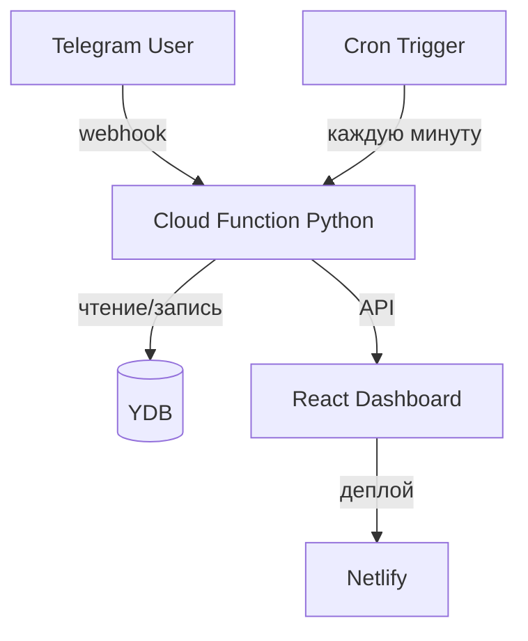

# 🤖 Miroslav Scheduler Bot

**Серверлесс-бот‑планировщик задач в Telegram с дашбордом на React.**  
Стек: Python · Yandex Cloud Functions · Yandex Database (YDB) · React · Netlify

---

## 📋 Возможности

| | |
|---|---|
| 📝 **Управление задачами** | Создание, редактирование, удаление задач через Telegram‑бота |
| ⏰ **Напоминания** | Проверка каждую минуту и отправка уведомлений о дедлайнах |
| 📊 **Веб‑дашборд** | Мини‑приложение на React: список задач, статистика, фильтры |
| ☁️ **Серверлесс‑архитектура** | Вся логика в Yandex Cloud Functions, нет сервера |
| 🗄 **Облачная БД** | Yandex Database (YDB): хранение задач, состояний диалогов, настроек |

---

## 🏗 Архитектура

- **Cloud Function** обрабатывает команды из Telegram (webhook) и вызывается триггером для проверки уведомлений, токен бота лежит в Yandex lockbox
- **YDB** — единое хранилище: задачи, диалоги, настройки пользователей
- **React‑приложение** взаимодействует с той же YDB через API‑функцию и развёрнуто на Netlify

---

## 🛠 Стек

| Слой | Технологии |
|---|---|
| Бэкенд | Python 3.10 · aiogram 3 · Yandex Cloud Functions |
| База данных | YDB (Yandex Database) · SQL‑запросы · ORM‑подход |
| Фронтенд | React 18 · TypeScript · CSS Modules |
| Деплой | Netlify (фронт) · Yandex Cloud (бэкенд + БД) |
| Уведомления | Cloud Trigger (cron: `* * * * *`) |

